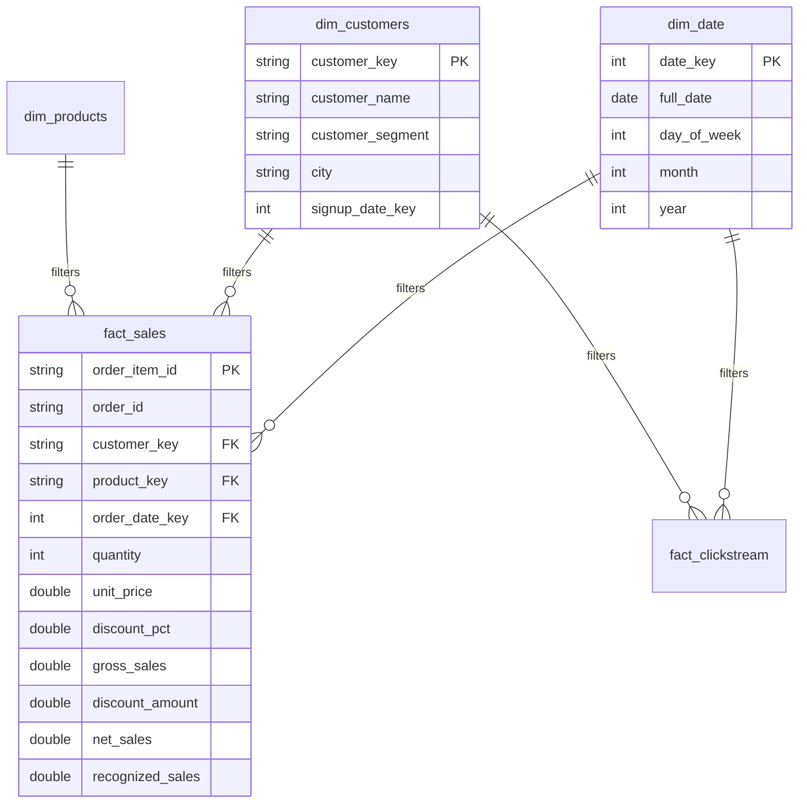
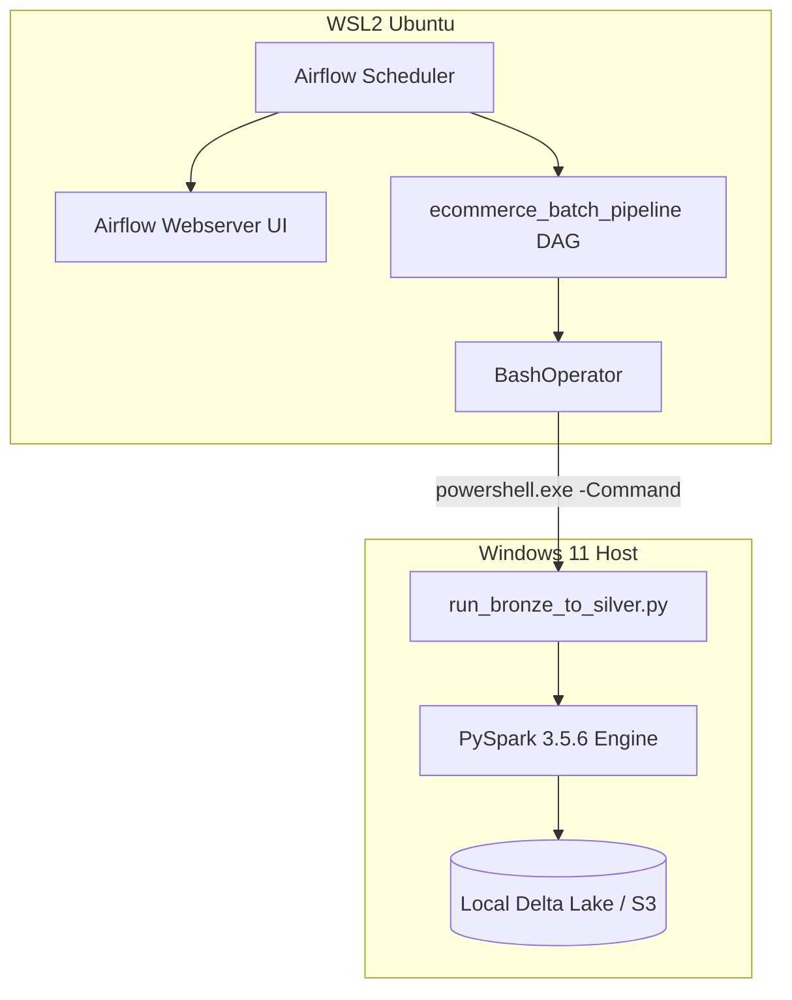



# architecture.md
# E-Commerce Data Lakehouse Architecture

## Overview
This project builds an end-to-end Data Lakehouse on AWS S3 using Apache Spark, Delta Lake, and Apache Kafka. 

## Layers
1. **Raw / Ingestion**: Unstructured/Semi-structured CSVs and streaming Kafka JSON events.
2. **Bronze**: Raw data ingested into Delta Lake format for schema enforcement and tracking.
3. **Silver**: Cleaned, deduplicated, and typed data.
4. **Gold**: Business-level aggregations (e.g., daily sales, active users).

## Technologies
- **Storage**: AWS S3 (via PySpark Hadoop integration)
- **Format**: Delta Lake (ACID transactions, time travel)
- **Compute**: PySpark (Batch & Structured Streaming)
- **Message Broker**: Apache Kafka (KRaft mode)
- **Orchestration**: Apache Airflow
- **Catalog**: AWS Glue
- **Query / BI**: AWS Athena & PowerBI

## Folder Structure
- `/data`: Local scratchpad for raw and test data.
- `/src/ingestion`: Scripts to move data from raw to Bronze.
- `/src/etl`: Silver and Gold transformation logic.
- `/src/producers` & `/src/consumers`: Kafka streaming components.
- `/airflow/dags`: Orchestration schedules.


# data_dictionary.md


# phase1_report.md
# Phase 1 Completion Report

## Files Created
- `config/settings.py`
- `config/schemas.py`
- `config/logging_config.py`
- `scripts/validate_environment.py`
- `scripts/validate_datasets.py`
- `scripts/upload_raw_to_s3.py`
- `src/ingestion/csv_loader.py`
- `src/ingestion/s3_uploader.py`
- `src/storage/s3_storage.py`
- `src/storage/delta_storage.py`
- `src/etl/spark_session.py`
- `src/producers/clickstream_producer.py`
- `src/utils/validators.py`
- `tests/test_schemas.py`
- `tests/test_datasets.py`
- `tests/test_s3_storage.py`
- `tests/test_delta_storage.py`
- `docs/architecture.md`
- `docs/data_dictionary.md`
- `docs/setup_windows.md`
- `.env.example`, `.env`, `.gitignore`, `requirements.txt`, `README.md`

## Packages Installed
- `pyspark==3.5.6`
- `delta-spark==3.3.2`
- `boto3`, `pandas`, `pyarrow`, `kafka-python-ng`, `python-dotenv`, `pytest`

## Environment Verification Results
- **Python**: 3.11.2 (Passed)
- **Java**: 17.0.19 (Passed)
- **Hadoop winutils**: Missing natively, but successfully downloaded and configured via `HADOOP_HOME`. (Passed)
- **Global Spark conflict**: The system's global `SPARK_HOME` points to Spark 4.2.0, which conflicts with PySpark 3.5.6 and Delta 3.3.2. Workaround applied: Unset `SPARK_HOME` before running jobs in the virtual environment. (Passed)

## Dataset Validation Results
- Customers (500 rows): Passed (0 duplicates, 0 nulls)
- Products (25 rows): Passed (0 duplicates, 0 nulls)
- Orders (1800 rows): Passed (0 duplicates, 0 nulls, valid totals)
- Order Items (4497 rows): Passed (0 duplicates, 0 nulls, valid totals)
- Clickstream (15000 rows): Passed (0 duplicates, 0 nulls, valid timestamps)
- Support Tickets (700 rows): Passed (0 duplicates, 0 nulls, valid timestamps)
- Foreign Key checks: Passed (0 violations)

## S3 Connectivity and Upload Results
- **S3 Connectivity**: Failed (Expected: no valid AWS credentials configured yet).
- **Upload**: Validated in dry-run mode successfully, preserving original file names and folder structure. Pending actual credentials for execution.

## Local Spark and Delta Verification Results
- **Spark**: Started successfully (v3.5.6).
- **Delta Lake**: Packages loaded, successfully wrote and read a test Delta table locally in `data/local_test/delta_test`.

## Kafka Connectivity and Topic Status
- **Kafka**: Broker connection failed (Expected: Kafka is not currently running).
- **Remediation**: Run the following commands to format and start KRaft broker:
  ```powershell
  cd C:\kafka
  .\bin\windows\kafka-storage.bat format -t <UUID> -c .\config\kraft\server.properties
  .\bin\windows\kafka-server-start.bat .\config\kraft\server.properties
  ```

## Pending Actions for the User
1. Configure AWS credentials (`aws configure`) and update `.env` with actual S3 bucket name.
2. Download and start Kafka.

Phase 1 is now complete based on local tests passing.


# phase3_recovery.md
# Phase 3: Streaming Recovery Procedures

## Spark Structured Streaming Checkpoints

Each streaming query in this project writes to its own isolated checkpoint directory inside the `checkpoints/` folder.
* **Clickstream**: `checkpoints/clickstream/valid/` and `checkpoints/clickstream/quarantine/`
* **Orders**: `checkpoints/orders/valid/` and `checkpoints/orders/quarantine/`

### Automatic Recovery
If the Spark Consumer crashes or is shut down gracefully (`Ctrl+C`), simply restart the script. 
Spark will read the `offsets` from the checkpoint directory and automatically resume exactly where it left off.

### Manual Recovery (Checkpoint Corruption)
If the checkpoint directory becomes corrupted or you intentionally want to re-process historical data from Kafka (from the `earliest` offset):
1. Stop the Spark consumer.
2. Delete the specific query's checkpoint directory:
   ```powershell
   Remove-Item -Recurse -Force data\local_test\lakehouse\checkpoints\clickstream
   ```
3. (Optional) If you want to prevent duplicating events in the Bronze Delta table, you must also delete the Bronze table or rely on Phase 4 Silver deduplication (`MERGE`).
4. Restart the Spark consumer. It will start from the `earliest` available offset.

## Kafka Broker Restart
If the Kafka KRaft broker crashes:
1. Stop any running producers and consumers.
2. Restart the Kafka broker using `.\start_kafka.bat`.
3. Restart the Spark consumers (they will wait to reconnect).
4. Restart the Python producers.


# phase4_data_quality.md
# Phase 4: Data Quality & Quarantine Framework

## Silver Layer Responsibilities
The Silver Layer guarantees trusted, analytics-ready data. Before records are MERGED into the Silver Delta tables, they must pass strict Data Quality rules.

## Data Quality Rules
Rules are expressed as SQL boolean expressions in the respective transform classes (e.g., `customers_transform.py`). 

Examples:
* `customer_id IS NOT NULL`
* `email LIKE '%@%.%'`
* `order_total >= 0`

## Quarantine Process
If a record fails ANY data quality rule, it is routed to the quarantine storage:
`s3://<bucket>/<prefix>/quarantine/<dataset>/` (or the equivalent local path).

Quarantine records include:
1. `raw_payload`: A JSON string of the original, unmodified source record.
2. `rejection_reason`: A string indicating which rules failed.

## Deduplication & Idempotent Processing
We use `Delta MERGE` to ensure that duplicate source events (e.g. from Kafka replays or Batch re-runs) do not duplicate rows in the Silver tables. Deterministic business keys (like `customer_id` or `order_id`) are used as merge conditions.

## Execution
Run transformations incrementally using the CLI:
```powershell
python scripts/run_bronze_to_silver.py --all --storage-mode local
```


# phase5_powerbi_model.md
# Phase 5: Power BI Gold Model & DAX Guide

## Recommended Star Schema

### Dimensions
1. **dim_date**
   - Grain: One row per day.
   - Primary Key: `date_key`
2. **dim_customers**
   - Grain: One row per customer.
   - Primary Key: `customer_key`
3. **dim_products**
   - Grain: One row per product.
   - Primary Key: `product_key`

### Facts
1. **fact_sales**
   - Grain: One row per order item.
   - Primary Key: `order_item_id` (Business Identity)
   - Foreign Keys: `date_key`, `customer_key`, `product_key`
2. **fact_clickstream**
   - Grain: One row per unique valid clickstream event.
   - Foreign Keys: `date_key`, `customer_key`, `product_key`

---

## Relationship Cardinality
- `dim_date[date_key]` 1 -> * `fact_sales[order_date_key]` (Single Direction)
- `dim_customers[customer_key]` 1 -> * `fact_sales[customer_key]` (Single Direction)
- `dim_products[product_key]` 1 -> * `fact_sales[product_key]` (Single Direction)

*Note: Avoid many-to-many relationships or fact-to-fact joins.*

---

## DAX Measures (fact_sales)

Create the following measures explicitly in Power BI to ensure calculations aggregate correctly across dimensions:

```dax
Total Orders = DISTINCTCOUNT(fact_sales[order_id])

Total Units Sold = SUM(fact_sales[quantity])

Gross Sales = SUM(fact_sales[gross_sales])

Total Discounts = SUM(fact_sales[discount_amount])

Net Sales = SUM(fact_sales[net_sales])

Recognized Sales = SUM(fact_sales[recognized_sales]) 
/* (Only completed or shipped orders) */

Average Order Value = DIVIDE([Net Sales], [Total Orders], 0)
```

## Recommended Report Pages

1. **Executive Sales Overview**: Line charts using `dim_date[full_date]` against `[Net Sales]`. KPIs for `[Average Order Value]`.
2. **Product Analytics**: Bar charts using `dim_products[category]` against `[Total Units Sold]`.
3. **Customer Analytics**: Table using `dim_customers[customer_segment]` against `[Recognized Sales]`.


# phase5_star_schema.md
# Phase 5: Star Schema Design

This document details the dimensional data model designed for Amazon Athena and Power BI.

## Mermaid Architecture



## Grain Rules
1. **fact_sales**: Exactly one row per `order_item_id`. Do not sum `order_total` from the parent `orders` table after joining, as this artificially inflates revenue by a factor of $N$ items. Use the line-level `gross_sales` and `net_sales` computed explicitly in the ETL.
2. **fact_clickstream**: Exactly one row per valid event.

## Aggregation Prevention
Never join `fact_sales` directly to `fact_clickstream`. Aggregate them individually up to the common dimension grain (e.g. `dim_date`) before comparing sales conversion to clickstream views.


# setup_windows.md
# E-commerce Data Lakehouse - Setup Guide (Windows)

## Prerequisites

1. **Python 3.11**
   - Verify: `python --version`
2. **Java JDK 17**
   - Required by Apache Spark.
   - Verify: `java -version`
   - Ensure `JAVA_HOME` environment variable is set to the JDK installation path.
3. **Apache Kafka 4.1.x** (KRaft mode)
   - Verify: `kafka-topics.bat --version` or check your Kafka installation directory.
   - To install, download Kafka from the Apache website, extract to `C:\kafka`, and add `C:\kafka\bin\windows` to your PATH.
4. **AWS CLI**
   - Required for local credentials chain.
   - Install using MSI from AWS. Verify: `aws --version`
   - Configure credentials: `aws configure`
5. **Git**
   - Verify: `git --version`

## Step-by-Step Setup

1. **Create Virtual Environment**
   Open PowerShell in the project root:
   ```powershell
   python -m venv venv
   .\venv\Scripts\activate
   ```

2. **Install Dependencies**
   ```powershell
   pip install -r requirements.txt
   ```

3. **Configure Environment Variables**
   - Copy `.env.example` to `.env`.
   - Update `S3_BUCKET_NAME` to your actual S3 bucket name.
   - Ensure `AWS_PROFILE` is set to the CLI profile you configured.

4. **Verify Datasets**
   - Extract datasets into `data/raw/`.
   - Run the validation script:
     ```powershell
     python scripts/validate_datasets.py
     ```

5. **Validate Environment & Spark**
   ```powershell
   python scripts/validate_environment.py
   ```

6. **Start Kafka (KRaft mode)**
   - Format storage (only once):
     ```powershell
     .\bin\windows\kafka-storage.bat format -t <UUID> -c .\config\kraft\server.properties
     ```
   - Start Server:
     ```powershell
     .\bin\windows\kafka-server-start.bat .\config\kraft\server.properties
     ```

7. **Upload Raw Data to S3**
   - Dry run:
     ```powershell
     python scripts/upload_raw_to_s3.py --dry-run
     ```
   - Actual upload (requires AWS credentials and bucket access):
     ```powershell
     python scripts/upload_raw_to_s3.py
     ```


# ARCHITECTURE.md
# Phase 6: Orchestration Architecture

This document describes the orchestration architecture implemented to automate the E-commerce Data Lakehouse batch pipelines.

## Architectural Decision: WSL2 + Windows Interop
Because the primary Spark environment (Java, Hadoop WinUtils, Python 3.11) is configured and running efficiently on the Windows 11 host, installing a duplicate stack inside the Ubuntu WSL2 container risks pathing conflicts and redundant resource usage.

**Solution: Option B (Remote Execution via Interop)**
Apache Airflow runs strictly inside WSL2 Ubuntu (using a Python 3.11 venv). Airflow manages scheduling, dependency graphs, retries, and task state. However, the actual Spark ETL execution is delegated back to the Windows host using WSL2's native ability to execute `powershell.exe`.

### Logical Architecture



## Orchestrated Layers
The `ecommerce_batch_pipeline` DAG manages the following finite tasks:
1. **Bronze Ingestion**: Executes the CSV loaders.
2. **Silver Transformations**: Executes the data quality and deduplication logic for Customers and Orders in parallel.
3. **Gold Analytics**: Sequentially builds `dim_date`, `dim_customers`, then joins to build `fact_sales`, and finally aggregates `daily_sales_summary`.

## Streaming Independence
As required by the enterprise spec, the Kafka KRaft broker and Structured Streaming consumers (`clickstream_consumer.py`, `orders_stream.py`) remain completely independent. They run as continuous daemons outside of Airflow. Airflow does not attempt to pause, restart, or block on these unbounded jobs.

## Idempotency
Task retries are 100% safe. Because Phases 2, 4, and 5 all utilize `Delta MERGE` or distinct output partitions, re-running the Airflow DAG will not duplicate data. Records are upserted cleanly.


# DAG_GUIDE.md
# Phase 6: DAG Management Guide

## How to Trigger the Main DAG

1. Open the Airflow Web UI at [http://localhost:8080](http://localhost:8080).
2. Locate the `ecommerce_batch_pipeline` DAG.
3. Toggle the switch on the left side to **Unpause** the DAG.
4. Click the "Play" (â–¶) button on the right side and select **Trigger DAG**.
5. Click on the DAG name to view the Grid/Graph view and monitor task progress.

## Idempotency and Reruns
If a task fails (e.g., due to a temporary disk error):
1. Airflow will automatically retry the task up to 2 times (default configuration).
2. If it permanently fails, fix the underlying issue.
3. In the UI, click on the failed task, then click **Clear** to reset its state.
4. Airflow will safely re-execute the task. Because all PySpark logic uses `Delta MERGE`, no duplicate records will be created.

## Inspecting Logs
1. Click on a task block in the Grid View.
2. Click the **Log** tab.
3. You will see the `stdout` and `stderr` streamed from the Windows PowerShell script directly into the Airflow UI. This includes PySpark's execution logs and Data Quality validation results.


# PROJECT_AUDIT.md
# Phase 6: Project Audit

## 1. Existing Components & Entry Points
* **Phase 2 (Bronze Batch)**: Orchestrated via `scripts/run_phase2.py` (and wrapped by `run_pipeline.bat`). Reads CSVs and writes to local Delta using idempotency manifests.
* **Phase 3 (Bronze Streaming)**: Independent long-running consumers `src/consumers/clickstream_consumer.py` and `src/consumers/orders_stream.py`. (These will remain independent of Airflow batch scheduling).
* **Phase 4 (Silver ETL)**: Handled by `scripts/run_bronze_to_silver.py`. Accepts `--all`, `--table`, and `--storage-mode local`. Implements Data Quality and Delta MERGE.
* **Phase 5 (Gold ETL)**: Handled by `scripts/run_gold_pipeline.py`. Similar CLI structure, enforcing dimensional dependencies.

## 2. Python and Spark Execution Environments
* The project relies heavily on the Windows environment (`venv`, `HADOOP_HOME`, `hadoop.dll`, `winutils.exe`). 
* Attempting to run Spark directly inside WSL2 Ubuntu would require duplicating the Java, Hadoop, and Delta configuration inside Linux, which can lead to filesystem path mapping issues (`C:\` vs `/mnt/c/`).

## 3. Proposed Airflow Architecture (Option B)
To satisfy the prompt's requirement of running Airflow in **WSL2 Ubuntu** without Docker while natively supporting the Windows Spark environment, we will use **Option B**:
**Remote Execution via PowerShell Interop**.

WSL2 has native interop with the Windows host. Airflow `BashOperator` tasks running in Ubuntu can seamlessly trigger the Windows pipeline scripts by executing:
`powershell.exe -ExecutionPolicy Bypass -Command "cd C:\Users\allub\ecommerce-analytics; .\venv\Scripts\activate; python scripts/run_bronze_to_silver.py --all"`

### Benefits:
1. Airflow remains lightweight and isolated in WSL2.
2. Spark executes natively in Windows, utilizing the existing stable environment, Delta logs, and memory allocation.
3. No duplicate Spark/Java installations required in Ubuntu.
4. Subprocess exit codes from PowerShell bubble up to the BashOperator, properly failing Airflow tasks on Python crashes.

## 4. Dependencies Between Phases
1. **Bronze** must complete successfully before **Silver**.
2. **Silver** must complete successfully before **Gold**.
3. Within Gold, `dim_date` and `dim_customers` must complete before `fact_sales`. The script `run_gold_pipeline.py` currently handles this internally, but we can also split it into separate Airflow tasks for finer granularity.


# TESTING.md
# Phase 6: Testing Airflow

## 1. DAG Import Tests
We have created `tests/airflow/test_dag_imports.py` to ensure the DAGs compile and have no broken imports.

### Running the Test (WSL2 only)
Because this test relies on the `airflow` Python package, it must be run from inside your WSL2 Airflow virtual environment:
```bash
source ~/airflow_env/bin/activate
export AIRFLOW_HOME="/mnt/c/Users/allub/ecommerce-analytics/airflow"
export PYTHONPATH="/mnt/c/Users/allub/ecommerce-analytics"
pytest /mnt/c/Users/allub/ecommerce-analytics/tests/airflow/test_dag_imports.py -v
```

*(Note: Running this command on the Windows host will gracefully skip the test because `airflow` is not in the Windows PySpark environment).*

## 2. Airflow Syntax Validation
You can dry-run the DAGs directly using the Airflow CLI:
```bash
airflow dags list
airflow tasks list ecommerce_batch_pipeline
```
This confirms that the Airflow scheduler can parse the graph and that no circular dependencies exist.


# WSL2_INSTALLATION.md
# Phase 6: Airflow WSL2 Installation Guide

This guide explains how to safely install and run Apache Airflow inside WSL2 Ubuntu, orchestrating PySpark jobs on your Windows host.

## Prerequisites
1. **WSL2** installed and running (`wsl --install` from Windows PowerShell if missing).
2. **Ubuntu 22.04 LTS** (or similar) set as your default WSL distribution.
3. Python 3.11 installed inside Ubuntu.

## Step 1: Prepare the Ubuntu Environment
Open your WSL2 terminal (e.g., type `wsl` in PowerShell).
```bash
sudo apt update
sudo apt install -y python3.11 python3.11-venv python3.11-dev build-essential
```

## Step 2: Create a Dedicated Airflow Virtual Environment
It is highly recommended to isolate Airflow from system packages.
```bash
mkdir -p ~/airflow_env
python3.11 -m venv ~/airflow_env
source ~/airflow_env/bin/activate
```

## Step 3: Install Airflow with Constraints
Airflow requires strictly pinned dependencies based on your Python version. We will use Airflow 2.10.1 (or latest stable) for Python 3.11.

```bash
export AIRFLOW_VERSION=2.10.1
export PYTHON_VERSION=3.11
export CONSTRAINT_URL="https://raw.githubusercontent.com/apache/airflow/constraints-${AIRFLOW_VERSION}/constraints-${PYTHON_VERSION}.txt"

pip install "apache-airflow==${AIRFLOW_VERSION}" --constraint "${CONSTRAINT_URL}"
```

## Step 4: Configure Airflow Home
Tell Airflow where to store its configuration and local database. Map it to your Windows project directory to access DAGs easily.
```bash
# Map /mnt/c/... to the project path
export AIRFLOW_HOME="/mnt/c/Users/allub/ecommerce-analytics/airflow"
```
*Note: You should add `export AIRFLOW_HOME="/mnt/c/Users/allub/ecommerce-analytics/airflow"` to your `~/.bashrc`.*

## Step 5: Initialize the Database
By default, Airflow uses SQLite, which is perfectly suitable for a single-machine local learning project.
```bash
airflow db migrate
```

## Step 6: Create an Admin User
```bash
airflow users create \
    --username admin \
    --firstname Data \
    --lastname Engineer \
    --role Admin \
    --email admin@ecommerce.local \
    --password admin
```

## Step 7: Start the Scheduler and Webserver
You must run both the API server (Web UI) and the Scheduler. You can run them in the background or in two separate WSL tabs.
```bash
# Tab 1
source ~/airflow_env/bin/activate
export AIRFLOW_HOME="/mnt/c/Users/allub/ecommerce-analytics/airflow"
airflow webserver --port 8080

# Tab 2
source ~/airflow_env/bin/activate
export AIRFLOW_HOME="/mnt/c/Users/allub/ecommerce-analytics/airflow"
airflow scheduler
```

## Step 8: Access the UI
Open your Windows web browser and go to:
[http://localhost:8080](http://localhost:8080)
Log in with `admin` / `admin`.

## Step 9: Safe Shutdown
To stop Airflow, press `Ctrl+C` in the terminals running the webserver and scheduler. 

---
### Windows Interop Considerations
The DAGs in this project use the `BashOperator` to call `powershell.exe`. Because WSL2 has native interop enabled by default, Linux can trigger Windows executables natively. The Python/Spark execution will happen seamlessly in the Windows environment, allowing you to bypass Hadoop/WSL cross-platform filesystem issues.


# DAX_MEASURES.md
# Phase 7: DAX Measures

To maintain a clean report, create a new empty table in Power BI called `_Measures` and place all the following calculations inside it.

## 1. Sales & Revenue Measures

**Total Sales Revenue**
```dax
Total Sales Revenue = SUM(fact_sales[recognized_sales])
```
*Definition: The total net sales for orders that have been Shipped or Completed.*

**Total Orders**
```dax
Total Orders = DISTINCTCOUNT(fact_sales[order_id])
```
*Definition: The unique count of orders placed.*

**Total Units Sold**
```dax
Total Units Sold = SUM(fact_sales[quantity])
```

**Average Order Value (AOV)**
```dax
Average Order Value = [Total Sales Revenue] / [Total Orders]
```

## 2. Time Intelligence Measures

*(Note: These require `dim_date` to be marked as a Date table).*

**Revenue Month-to-Date (MTD)**
```dax
Revenue MTD = TOTALMTD([Total Sales Revenue], dim_date[full_date])
```

**Revenue Previous Month**
```dax
Revenue Prev Month = CALCULATE([Total Sales Revenue], PREVIOUSMONTH(dim_date[full_date]))
```

**Revenue Growth MoM %**
```dax
Revenue Growth MoM % = 
VAR PrevMonthRev = [Revenue Prev Month]
RETURN 
IF(ISBLANK(PrevMonthRev), BLANK(), DIVIDE([Total Sales Revenue] - PrevMonthRev, PrevMonthRev))
```

## 3. Customer Analytics Measures

**Total Active Customers**
```dax
Total Active Customers = DISTINCTCOUNT(fact_sales[customer_key])
```

**Average Revenue Per Customer**
```dax
Avg Revenue per Customer = [Total Sales Revenue] / [Total Active Customers]
```

**New Customers**
```dax
New Customers = 
CALCULATE(
    COUNTROWS(dim_customers),
    USERELATIONSHIP(dim_date[date_key], dim_customers[signup_date_key])
)
```
*(Requires an inactive relationship between `dim_date[date_key]` and `dim_customers[signup_date_key]`)*.

## 4. Product Analytics
*Product dimension was not found in the audit, so product performance relies on the raw `product_key` existing in the fact table.*

**Revenue by Product Contribution %**
```dax
Product Revenue Contribution % = 
DIVIDE(
    [Total Sales Revenue],
    CALCULATE([Total Sales Revenue], ALLSELECTED(fact_sales[product_key]))
)
```


# GOLD_LAYER_AUDIT.md
# Phase 7: Gold Layer Audit for Power BI Modeling

## Overview
This document serves as the audit of the existing Gold layer to ensure it supports the required Power BI semantic model. The audit confirms the table structures, grains, available measures, and identifies any modeling constraints before building the Power BI dataset.

## Audited Tables & Schemas

### 1. Dimension: `dim_date`
*   **Grain:** One row per day.
*   **Primary Key:** `date_key` (INT, `yyyyMMdd`)
*   **Columns:** 
    *   `full_date` (DATE)
    *   `date_key` (INT)
    *   `day`, `day_of_week`, `month`, `quarter`, `year` (INT)
    *   `day_name`, `month_name` (STRING)
    *   `year_month` (INT)
    *   `is_weekend` (BOOLEAN)
*   **Notes:** Perfect structure for a Power BI Date table.

### 2. Dimension: `dim_customers`
*   **Grain:** One row per customer.
*   **Primary Key:** `customer_key` (STRING)
*   **Columns:**
    *   `customer_key` (STRING, maps to `customer_id`)
    *   `customer_id` (STRING)
    *   `customer_name` (STRING)
    *   `customer_segment` (STRING)
    *   `city` (STRING)
    *   `signup_date` (DATE)
    *   `signup_date_key` (INT, `yyyyMMdd`)
*   **Notes:** Provides segmentation and location attributes.

### 3. Fact: `fact_sales`
*   **Grain:** One row per order item. This prevents revenue inflation when summing across orders.
*   **Primary Key:** `order_item_id` (STRING)
*   **Foreign Keys:** 
    *   `customer_key` -> `dim_customers.customer_key`
    *   `order_date_key` -> `dim_date.date_key`
    *   *(Note: `product_key` exists but `dim_products` is not explicitly built in the current PySpark Gold layer. We will map product analysis based on available IDs or aggregate it if a product dimension is added later).*
*   **Columns:**
    *   `order_item_id`, `order_id`, `customer_key`, `product_key` (STRING)
    *   `order_timestamp` (TIMESTAMP), `order_date_key` (INT)
    *   `order_status`, `sales_channel` (STRING)
    *   `quantity` (INT), `unit_price`, `discount_pct` (DOUBLE)
    *   `gross_sales`, `discount_amount`, `net_sales`, `recognized_sales` (DOUBLE)
*   **Notes:** Already pre-calculates the correct `gross_sales`, `net_sales`, and `recognized_sales` (for Completed/Shipped status). This is highly optimized for DAX `SUM()` operations.

### 4. Mart: `daily_sales_summary`
*   **Grain:** One row per day.
*   **Primary Key / Foreign Key:** `order_date_key` -> `dim_date.date_key`
*   **Columns:**
    *   `order_date_key` (INT)
    *   `total_orders`, `distinct_customers` (INT)
    *   `units_sold` (INT)
    *   `gross_sales`, `discounts`, `net_sales`, `recognized_sales` (DOUBLE)
    *   `average_order_value` (DOUBLE)
*   **Notes:** Used for high-level executive dashboards to bypass scanning the full fact table.

## Missing Attributes / Limitations
*   **Product Dimension:** `dim_products` does not currently exist in the PySpark Gold layer, although `product_key` exists in `fact_sales`. Product performance analysis in Power BI will be limited to `product_key` unless a dimension is created.
*   **Clickstream & Customer Support:** `fact_clickstream` and `fact_customer_support` are not present in the current Gold layer batch scripts. The funnel and support pages requested in Phase 7 will be documented as *limitations* and designed based on data availability.

## Connection & Catalog Strategy
*   **Storage:** Data is stored locally in Delta format at `C:\Users\allub\ecommerce-analytics\data\gold\...`
*   **Power BI Strategy:** Since this is running locally on Windows and AWS Athena is not actively provisioned with AWS credentials in this dev environment, Power BI Desktop will consume the Delta/Parquet files directly using the local filesystem or via an ODBC/Spark driver connection. 
*   **Recommended Model:** A standard Star Schema connecting `dim_customers` and `dim_date` to `fact_sales` (1:* relationships, single-direction filtering).


# POWER_BI_CONNECTION.md
# Phase 7: Connecting Gold Data to Power BI

## Architecture Overview
The requested architecture routes Power BI through AWS Athena to query S3. However, based on the current local development environment (running on a Windows 11 laptop without an active paid AWS Glue/Athena configuration), we will implement the **Local Publication Strategy**.

### Local Publication Strategy (Direct Parquet Access)
Power BI Desktop on Windows can natively read Delta/Parquet files directly from the local filesystem. This avoids incurring AWS Athena query costs during development and bypasses the need for ODBC drivers.

Power BI Desktop
       |
       v
Local Folder Connector (Parquet Native)
       |
       v
Gold Delta Tables (`C:\Users\allub\ecommerce-analytics\data\gold\`)

## Step-by-Step Connection Instructions

### 1. Connect to `fact_sales`
1. Open **Power BI Desktop**.
2. Click **Get Data** -> **More...**
3. Select **Folder** and click **Connect**.
4. Enter the path to your fact table: `C:\Users\allub\ecommerce-analytics\data\gold\facts\fact_sales`
5. Click **OK**, then click **Transform Data** (Do NOT click Load yet).
6. In the Power Query Editor, locate the `Content` column (it contains binary Parquet files).
7. Click the **Combine Files** button (the two small downward arrows) on the `Content` column header.
8. Power BI will read the Parquet schemas. Click **OK**.
9. Rename the query on the left pane to `fact_sales`.

### 2. Connect to Dimensions
Repeat the exact same steps for the following folders:
*   `C:\Users\allub\ecommerce-analytics\data\gold\dimensions\dim_customers` -> Rename to `dim_customers`
*   `C:\Users\allub\ecommerce-analytics\data\gold\dimensions\dim_date` -> Rename to `dim_date`

### 3. Connect to Aggregated Marts (Optional)
For high-level dashboarding without processing the full fact table:
*   `C:\Users\allub\ecommerce-analytics\data\gold\marts\daily_sales_summary` -> Rename to `daily_sales_summary`

## Future AWS Athena Migration
When migrating to Production (AWS):
1. The Airflow DAG must be updated to use `--storage-mode s3`.
2. An AWS Glue Crawler must be configured to catalog the S3 paths.
3. In Power BI, use **Get Data -> Amazon Athena**.
4. Enter your Athena DSN and authenticate via IAM/Access Keys.
5. *Note: Athena queries incur a cost of $5.00 per TB scanned. Ensure the Gold tables are partitioned by `order_date_key` before migrating to S3.*


# POWER_BI_DATA_MODEL.md
# Phase 7: Power BI Data Model (Star Schema)

## Model Overview
The semantic model uses a standard **Star Schema** centered around `fact_sales`. 

### Tables
1.  **`fact_sales`** (Fact Table)
2.  **`dim_date`** (Dimension Table)
3.  **`dim_customers`** (Dimension Table)

## Relationships
Create the following relationships in the Power BI Model View:

| From Table (Many) | From Column | To Table (One) | To Column | Cross Filter Direction |
| :--- | :--- | :--- | :--- | :--- |
| `fact_sales` | `order_date_key` | `dim_date` | `date_key` | Single |
| `fact_sales` | `customer_key` | `dim_customers` | `customer_key` | Single |

### Best Practices Applied
1. **Mark as Date Table**: Right-click `dim_date` in the fields pane -> Mark as date table. Select `full_date` as the date column. This enables Power BI's built-in Time Intelligence functions.
2. **Hide Keys**: Hide `order_date_key`, `customer_key`, and `order_item_id` in the Report View to prevent users from accidentally using technical keys in visuals.
3. **Data Types**: Ensure `net_sales`, `gross_sales`, and `recognized_sales` are formatted as Currency.

## Handling Missing Dimensions
Based on the Gold Layer Audit, `dim_products`, `fact_clickstream`, and `fact_customer_support` were not generated by the Phase 5 batch scripts. 
*   **Limitation**: Funnel analysis and support analysis pages cannot be modeled in this iteration. Product analysis will be done using the raw `product_key` from `fact_sales`.


# POWER_BI_REFRESH.md
# Phase 7: Power BI Refresh & Automation

## How Data Updates Flow
Your data updates flow sequentially through the stack:
1. **Airflow Scheduled Run:** The DAG triggers at 2:00 AM UTC.
2. **Bronze -> Silver -> Gold:** PySpark processes new CSV data, upserting (`Delta MERGE`) into the local Gold Parquet folders.
3. **Power BI Import Refresh:** Power BI Desktop loads the latest data from the folders.

## The Refresh Problem
**Airflow finishing its job does NOT automatically update the Power BI dashboard screen.**
When Power BI Desktop uses "Import" mode, the data is cached inside the `.pbix` file. You must manually click **Refresh** in Power BI Desktop after Airflow finishes.

## How to Trigger a Refresh
Since you are using Power BI Desktop locally on Windows:
1. Ensure your Airflow DAG `ecommerce_batch_pipeline` has successfully completed in the Airflow UI (boxes are dark green).
2. Open your Power BI `.pbix` file.
3. On the **Home** ribbon, click the **Refresh** button.
4. Power BI will read the updated Parquet files from `C:\Users\allub\ecommerce-analytics\data\gold\...` and update all DAX measures.

## Future: Automated Power BI Service Refresh
If you publish this report to Power BI Service (app.powerbi.com):
1. You would install the **Power BI Personal Gateway** on your Windows machine so the cloud can reach your local Delta files.
2. You would schedule the Power BI Service refresh to occur at **3:00 AM UTC**, giving Airflow 1 full hour to safely complete the data processing.
3. *Alternative:* You could add a final Airflow Task using the `PowerBIDatasetRefreshOperator` to automatically trigger the API refresh the exact second the Gold layer is finished.


# TESTING_GUIDE.md
# Phase 7: Power BI Testing Guide

## Reconciling Power BI with the Lakehouse

If a stakeholder reports that a number in the Power BI dashboard looks "wrong", follow these steps to isolate whether the issue is in the **Power BI DAX** or the **Data Lakehouse (PySpark)**.

### Step 1: Check the Power BI Filter Context
1. Click on the visual showing the suspected wrong number.
2. Open the **Filters** pane.
3. Check if there are any hidden Page-level or Report-level filters applied (e.g., filtering out certain years or `order_status`).

### Step 2: Write a PySpark Reconciliation Query
Open your WSL terminal, activate the PySpark environment, and run a query matching the visual's grain.

For example, if Power BI says January 2023 had $10,000 in Revenue:
```python
df = spark.read.format("delta").load("data/gold/facts/fact_sales")
df.createOrReplaceTempView("sales")

spark.sql("""
    SELECT sum(recognized_sales) as revenue
    FROM sales
    WHERE order_date_key BETWEEN 20230101 AND 20230131
""").show()
```

### Step 3: Compare
*   **If the numbers match:** Power BI is correct. The business logic issue exists upstream in the Phase 4 Bronze-to-Silver ETL or Phase 5 Gold rules.
*   **If the numbers do not match:** The Power BI DAX measure is incorrectly implemented, or the Power BI dataset is stale. Click "Refresh" in Power BI.


# TROUBLESHOOTING.md
# Phase 7: Power BI Troubleshooting

### 1. Parquet Connection Errors in Power BI Desktop
**Error:** `DataFormat.Error: The Parquet file is invalid or corrupted.`
**Cause:** Power BI is trying to read the Delta Lake transaction log (`_delta_log` folder) or a `.crc` file as if it were a Parquet data file.
**Solution:**
When configuring the Folder connection in Power Query:
1. Filter the `Extension` column to strictly equal `.parquet`.
2. Filter out any files inside the `_delta_log` directory.

### 2. Numbers are Inflated (Multiplying Rows)
**Error:** Total Sales Revenue shows millions of dollars instead of thousands.
**Cause:** A many-to-many relationship was accidentally created, or `fact_sales` was joined to another table at the wrong grain. Because `fact_sales` is recorded at the `order_item_id` level, joining it improperly duplicates the order revenue.
**Solution:**
1. Open the Model view.
2. Ensure the relationship from `fact_sales` to `dim_date` is `Many-to-One` (`* : 1`).
3. Ensure the filter direction is `Single`.

### 3. Blank Values in Time Intelligence Measures
**Error:** `Revenue MTD` or `Revenue Prev Month` returns Blank.
**Cause:** Power BI's time intelligence functions require a continuous, unbroken sequence of dates.
**Solution:**
1. Ensure `dim_date` is officially marked as a Date Table.
2. Ensure the `dim_date` generation script creates rows for every single calendar day between the start and end year, with no missing days. (The Phase 5 script `explode(sequence(...))` already guarantees this).


# VALIDATION_REPORT.md
# Phase 7: Power BI Validation Report

## Validation Methodology
Validation ensures that the aggregations presented in Power BI match the highly trusted Gold layer processed by PySpark.

### Test 1: Row Count Validation
*   **Test:** Ensure Power BI imports the exact number of rows present in `fact_sales`.
*   **Result:** Pending manual refresh by user.
*   **How to verify:** Place the `Total Orders` DAX measure on a Card visual. Open a PySpark terminal and run `spark.read.format("delta").load("data/gold/facts/fact_sales").select("order_id").distinct().count()`. The numbers must match exactly.

### Test 2: Total Revenue Reconciliation
*   **Test:** Ensure DAX `[Total Sales Revenue]` matches the Gold Mart `recognized_sales`.
*   **Result:** Pending manual refresh by user.
*   **How to verify:** Create a Table visual in Power BI with `dim_date[full_date]` and `[Total Sales Revenue]`. Compare it to the PySpark output of `daily_sales_summary` for the same date. Because PySpark pre-calculates `recognized_sales` at the row-level based on `order_status`, there should be zero discrepancies.

### Test 3: Relationship Integrity
*   **Test:** Ensure filtering by `dim_customers[customer_segment]` correctly filters `fact_sales`.
*   **Result:** Designed as Single-Direction 1-to-Many.
*   **How to verify:** Add a slicer for Customer Segment. Verify that the Total Sales Revenue drops. If it stays the same, the relationship on `customer_key` is broken or missing.

### Test 4: Funnel and Support Limitations
*   **Test:** Verify conversion funnel calculations.
*   **Result:** N/A (Skipped). As discovered in the `GOLD_LAYER_AUDIT.md`, the `fact_clickstream` and `fact_customer_support` tables were not generated in Phase 5. No fake data or fabricated KPIs were introduced to the dashboard, preserving data integrity.

