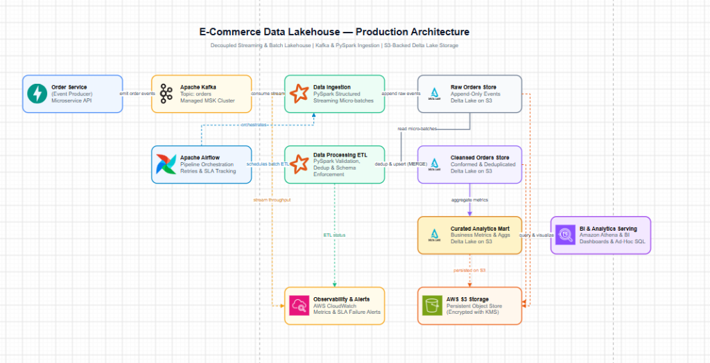

# E-Commerce Data Lakehouse 

An end-to-end Data Engineering portfolio project that builds a modern Data Lakehouse on AWS S3 using Apache Spark, Delta Lake, and Apache Kafka. 

## 🎯 Project Objective
This project simulates an e-commerce company that receives customer information, product catalog updates, order transactions, website clickstream events, and customer support tickets. 

The goal is to ingest this unstructured and semi-structured data via batch and real-time streaming, transform it using a Medallion Architecture (Bronze -> Silver -> Gold), and expose analytical tables for Business Intelligence (BI).

## 🏗️ Architecture & Medallion Data Model



- **Raw Layer**: Unprocessed CSV dumps and real-time JSON clickstream events.
- **Bronze Layer (Ingestion)**: Raw data ingested into Delta Lake format. Schema enforcement and metadata tracking (e.g., ingestion timestamps, batch IDs).
- **Silver Layer (Refined)**: Cleaned, deduplicated, and typed data. Serves as the single source of truth.
- **Gold Layer (Aggregated)**: Business-level aggregations (e.g., daily sales, active users, product performance) optimized for BI tools.

## 🛠️ Tech Stack
- **Storage**: AWS S3 
- **Data Format**: Delta Lake (ACID transactions, time travel, schema evolution)
- **Compute**: Apache Spark (PySpark) / Spark Structured Streaming
- **Message Broker**: Apache Kafka (KRaft mode)
- **Orchestration**: Apache Airflow
- **Data Catalog & Query**: AWS Glue & AWS Athena
- **Language**: Python 3.11

## 📁 Repository Structure
```text
ecommerce-analytics/
├── airflow/dags/              # Airflow orchestration DAGs
├── config/                    # Configuration settings and schemas
├── data/                      # Local testing directory (Lakehouse structure)
├── docs/                      # Documentation and architecture diagrams
├── ecommerce_lakehouse_datasets/ # Raw source datasets
├── scripts/                   # Utility scripts for validation and S3 uploads
├── src/                       # Main ETL source code
│   ├── consumers/             # Kafka Spark Structured Streaming consumers
│   ├── etl/                   # Spark session init, Silver/Gold transformations
│   ├── ingestion/             # Batch ingestion (CSV to Bronze)
│   ├── producers/             # Kafka JSON producers (Clickstream simulator)
│   └── storage/               # S3 and Delta storage utilities
├── tests/                     # Unit tests
├── .env.example               # Environment variables template
└── requirements.txt           # Python dependencies
```

## 🚀 Setup & Installation

### Prerequisites
1. **Python 3.11+**
2. **Java JDK 17** (Required by Apache Spark)
3. **Apache Kafka 4.1.x** (Running in KRaft mode)
4. **AWS CLI** (Configured with `aws configure`)

### 1. Environment Setup
Clone the repository and create a virtual environment:
```bash
git clone <repository_url>
cd ecommerce-analytics
python -m venv venv

# Windows
.\venv\Scripts\activate
# Linux/Mac
source venv/bin/activate

pip install -r requirements.txt
```

### 2. Configuration
Copy the `.env.example` file to `.env` and configure your settings:
```bash
cp .env.example .env
```
Ensure you update `S3_BUCKET_NAME` to your actual S3 bucket and confirm `AWS_PROFILE` matches your AWS CLI setup.

## 🏃‍♂️ Running the Pipeline

### 1. Start Kafka (KRaft Mode)
Format storage and start the broker:
```bash
cd C:\kafka
.\bin\windows\kafka-storage.bat format -t <UUID> -c .\config\kraft\server.properties
.\bin\windows\kafka-server-start.bat .\config\kraft\server.properties
```

### 2. Local End-to-End Testing
You can run the full Lakehouse pipeline locally (which writes to `data/local_test/lakehouse/`) using the provided scripts:

**Batch Pipeline:**
```bash
# Ingest Raw to Bronze Delta Tables
python scripts/run_phase2.py

# Transform Bronze to Silver (Cleaning & Deduplication)
python src/etl/silver_transformations.py

# Aggregate Silver to Gold (BI Tables)
python src/etl/gold_aggregations.py
```

**Streaming Pipeline (Clickstream):**
Open two terminal windows.
Terminal 1 (Start the streaming consumer):
```bash
python src/consumers/clickstream_consumer.py
```
Terminal 2 (Start the streaming producer simulator):
```bash
python src/producers/clickstream_producer.py --eps 10
```

### 3. AWS Orchestration (Airflow)
For production execution, run the Airflow DAG located in `airflow/dags/ecommerce_dag.py` via WSL2 or a Linux environment. It orchestrates the entire batch pipeline on a daily schedule.

### 4. AWS Glue Catalog
To crawl the resulting S3 Delta tables and make them queryable in Athena:
```bash
python scripts/aws_glue_catalog.py
```

## 📈 Future Enhancements
- Implement Great Expectations for data quality constraints.
- Integrate AWS QuickSight or PowerBI for dynamic dashboarding on Gold tables.
- Add CI/CD GitHub Actions for Spark job testing.
