# E-Commerce Data Lakehouse — Technical Specification

## 1. System Overview

An enterprise cloud data lakehouse engineered to ingest, cleanse, aggregate, and serve real-time transactional e-commerce order events. The platform captures order streams through **Apache Kafka**, executes distributed processing via **PySpark**, persists conformed tables in an **AWS S3-backed Delta Lake**, and enables low-latency BI analytics via **Amazon Athena**.

---

## 2. Core Architecture & Technology Stack

<div align="center">

| Layer | Component | Responsibility |
| :--- | :--- | :--- |
| **Source** | Order Service API | Emits transactional order events |
| **Ingestion** | Apache Kafka (Amazon MSK) | High-throughput distributed message broker |
| **Stream Engine** | PySpark Structured Streaming | Micro-batch streaming consumer with checkpointing |
| **Lakehouse Core** | Delta Lake on AWS S3 | ACID transactions, schema enforcement, time-travel |
| **Batch Processing**| PySpark ETL | Validation, windowed deduplication, idempotent upserts |
| **Object Storage** | AWS S3 Storage | Persistent cloud storage encrypted with AWS KMS |
| **Orchestration** | Apache Airflow | Scheduled execution, task retries, table compaction |
| **Observability** | AWS CloudWatch | Stream lag, pipeline metrics, and failure alerts |
| **Serving & BI** | Amazon Athena & QuickSight | Interactive SQL queries and business dashboards |

</div>

---

## 3. End-to-End Data Pipeline Flow

```mermaid
flowchart LR
    Order["Order Service API"]
    Kafka["Apache Kafka\n(Topic: orders)"]
    SparkStream["PySpark Streaming\n(Micro-batches)"]
    RawStore[("Raw Orders Store\nDelta Lake on S3")]
    SparkETL["PySpark Processing\n(Dedup & Cleanse)"]
    CleansedStore[("Cleansed Orders Store\nDelta Lake on S3")]
    CuratedMart[("Curated Analytics Mart\nDelta Lake on S3")]
    Athena["Amazon Athena\nBI & Analytics"]

    Order -->|emit order events| Kafka
    Kafka -->|stream consume| SparkStream
    SparkStream -->|append raw| RawStore
    RawStore -->|read micro-batches| SparkETL
    SparkETL -->|idempotent MERGE| CleansedStore
    CleansedStore -->|aggregate metrics| CuratedMart
    CuratedMart -->|query & serve| Athena
```



---

## 4. Storage Architecture

```text
AWS S3 Base Bucket: s3://ecommerce-lakehouse-prod/
│
├── raw/orders/            --> Raw Orders Store (Append-only Delta Lake)
├── cleansed/orders/       --> Cleansed Orders Store (Deduplicated & Conformed Delta Lake)
├── curated/fact_orders/   --> Curated Analytics Mart (Aggregated Star-Schema Delta Lake)
├── checkpoints/orders/    --> Streaming Offset Checkpoints
└── bad_records/           --> Schema Mismatch / Malformed Event Quarantine
```

### Storage Layer Classifications

| Layer | Primary Role | Write Mode | Partition Key | Maintenance |
| :--- | :--- | :--- | :--- | :--- |
| **Raw Orders Store** | Preserves raw JSON payloads, partition offsets, and timestamps | Append-Only | `ingestion_date=YYYY-MM-DD` | 90-day retention; S3 Intelligent-Tiering |
| **Cleansed Orders Store** | Schema-enforced, validated, and deduplicated order states | Idempotent Upsert (`MERGE`) | `event_date=YYYY-MM-DD` | Daily auto-compaction to 128 MB files |
| **Curated Analytics Mart** | Pre-aggregated business KPIs and dimensional tables | Append / Overwrite | `event_date=YYYY-MM-DD` | `OPTIMIZE ZORDER BY (customer_id, product_id)` |

---

## 5. Pipeline Implementation Specifications

### 5.1 Ingestion & Checkpointing
- Ingests from Kafka topic `orders` with structured streaming micro-batches (trigger: 60 seconds).
- Persists stream state to S3 checkpoints, ensuring at-least-once ingestion combined with Delta ACID guarantees for **end-to-end exactly-once semantics**.

### 5.2 Deduplication & Cleansing
- Deduplicates on `order_id` keeping the latest state using:
  ```sql
  ROW_NUMBER() OVER (PARTITION BY order_id ORDER BY updated_timestamp DESC, kafka_offset DESC)
  ```
- Executes Delta Lake `MERGE` to update order state transitions (`CREATED` $\rightarrow$ `PAID` $\rightarrow$ `SHIPPED` $\rightarrow$ `DELIVERED`).

### 5.3 Serving Optimization
- Aggregates daily order volumes, gross revenue, and customer metrics.
- Employs file compaction (128 MB target) and Z-Ordering by `(customer_id, product_id)` to reduce Athena query scan volumes by over 40%.

---

## 6. Data Quality & Orchestration

### Quality Gates
- **Null Constraints**: Non-nullable primary keys (`order_id`, `customer_id`).
- **Numeric Validation**: Strict checks ensuring positive values for price, quantity, and total amount.
- **Circuit Breaker**: Pipeline immediately stops downstream tasks upon schema violations or primary key null counts $> 0$, sending a CloudWatch alert while keeping previous curated data intact.

### Airflow Orchestration
- **Schedule**: Daily batch execution (`02:00 UTC`).
- **Task Progression**: Cleansed Processing $\rightarrow$ Data Quality Validation $\rightarrow$ Curated Aggregation $\rightarrow$ Delta Maintenance (`OPTIMIZE` & `VACUUM`).
- **Failure Handling**: 3 retries with exponential backoff (5 min initial delay, up to 30 min max).

---

## 7. Performance & Operational Targets

| Target Metric | Benchmark Target |
| :--- | :--- |
| **Event Ingestion Latency** | $< 60$ seconds from Kafka emit to Raw Store |
| **Athena Query Latency** | $< 2.5$ seconds (P95) on Curated Analytics Mart |
| **Pipeline Reliability** | $99.9\%$ automated run success rate |
| **Recovery Point Objective (RPO)** | $< 5$ minutes for streams; $0$ data loss for orders |
| **Recovery Time Objective (RTO)** | $< 30$ minutes via checkpoint recovery |
